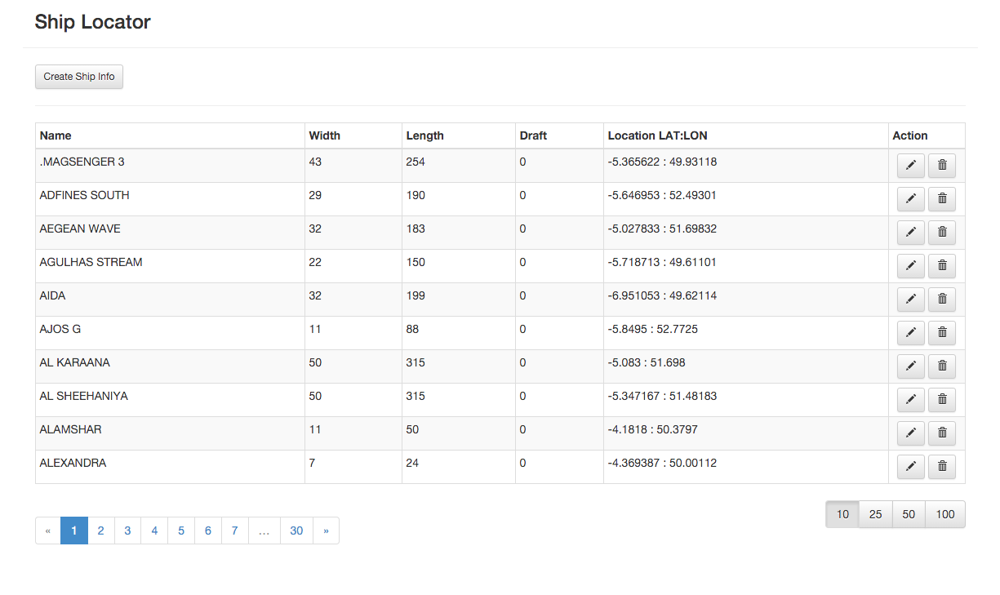
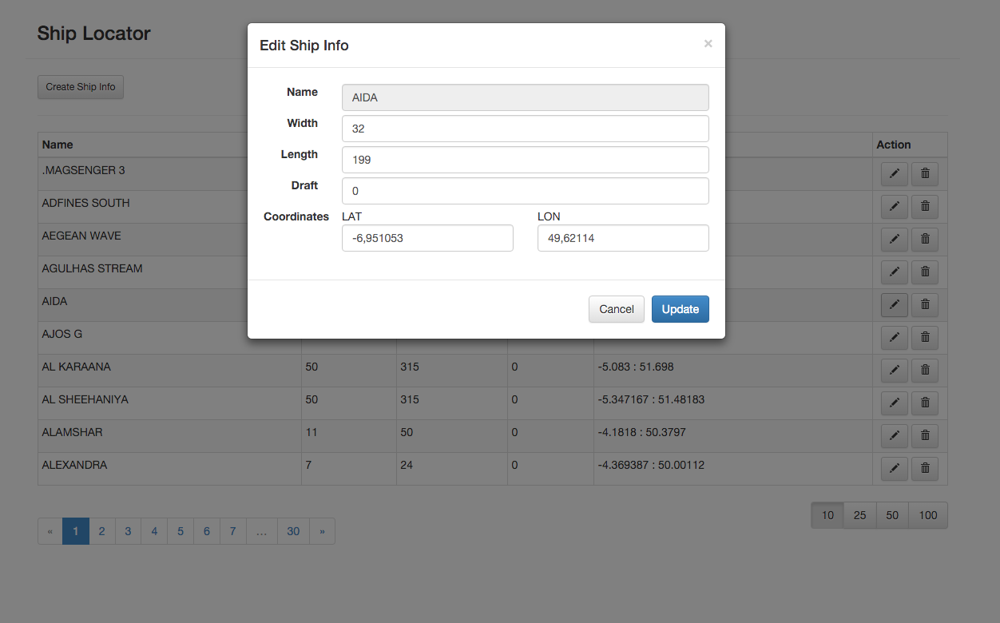

## Ship Locator
===========

The project is an exercise of using Play2/Scala/ReactiveMongo/AngularJs/Bootstrap
Based on https://github.com/lashford/modern-web-template

## Screenshots

#### Main window

#### Create a Ship

#### Update a Ship

## TODO:
1. Verify edited data
2. Make possible updating name 
3. Make possible filtering by ship name