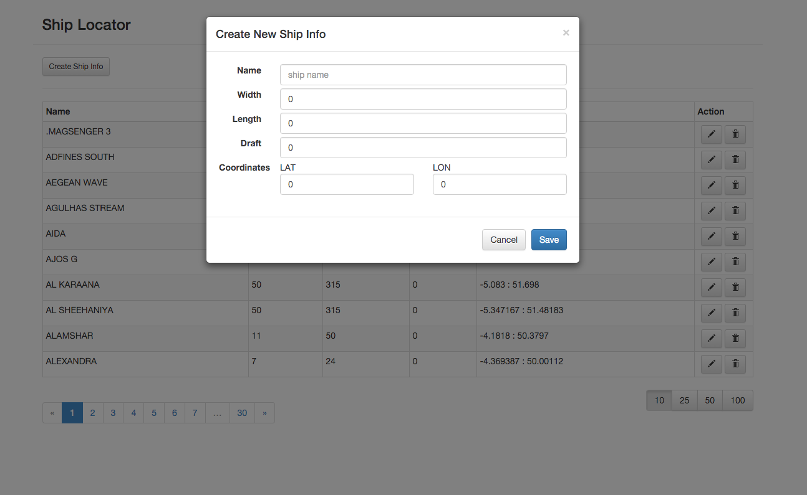

### Ship Locator
===========
The project is an exercise of using Play2/Scala/ReactiveMongo/AngularJs/Bootstrap

Based on (https://github.com/lashford/modern-web-template)

#### To run:

clone the project, and execute from the project root:

```
 ./activator clean run
```

### Screenshots

#### Main window


#### Create a Ship


#### Update a Ship


## TODO:
- Add data verification
- Make possible updating name (currently name is used as primary key for simplicity)
- Make possible filtering the table by ship name, change ordering etc